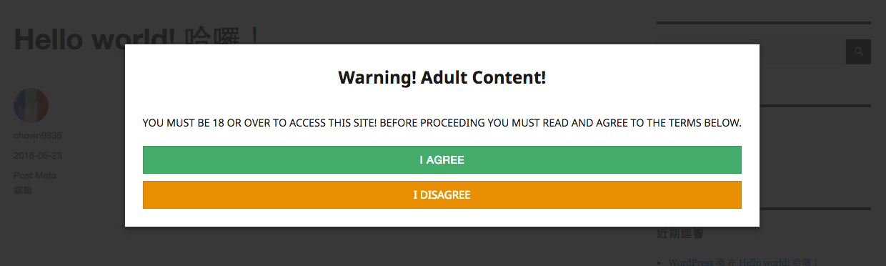

# WP Content Restriction
⛔ You can use this plugin to show up notice on article / page. Like "Cookie Notice" or "Adult Content Notice".

## Installation

## Screenshots

## Pre-release feature (Order by priority)
* Custom mobile advertisement.
* Do not show again checkbox.
* Custom notice box width. (Desktop/Mobile/RWD)
* Enable to show "I <3 WP Content Restriction"
* Custom title/body/button color.
* Custom notice box HTML.
* Custom notice box Style (css).
* Script load from CDN. (option)
* Custom notice content and title font-size.
* Enable on homepage.
* Enable on site.

## Change Log
All change log on this repo release list: [https://github.com/chown9835/wp-content-restriction/releases](https://github.com/chown9835/wp-content-restriction/releases)

## Thanks
* [Shen Cheng Ta](https://www.facebook.com/kocpc) : Concept generation.
* [電腦王阿達的 3C 胡言亂語](https://www.kocpc.com.tw) : Production environment test.
* [Chris Chang](https://github.com/chris1004tw) : Translation.
* [WordPress](https://wordpress.com/) : Awesome platform for blogging.